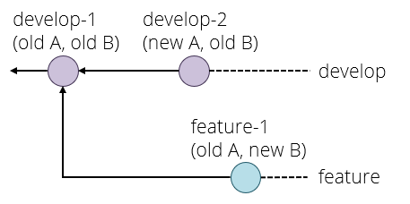

# Git, part 3

In this activity you will practice Git the way it is used in real teams. You will need to form a group for this activity, ideally more than two students.

## Set-up

One member makes a Git repository on one of the online providers, adds the other team members and shares the cloning URL. Everyone clones the repository.

The repository must have at least one commit for the following to work. This condition is satisfied if you chose your provider's option to create a readme file; if not then make a file now, commit it and push.

## The develop branch

By default, your repository has one branch named `master`. One team member creates a `develop` branch with the command

    git checkout -b develop

The team member who created the develop branch should now make a commit on it.

This branch currently exists only in their local repository, and if they try and push they would get a warning about this.
What they need to do is

    git push --set-upstream origin develop

This adds an "upstream" entry on the local develop branch to say that it is linked to the copy of your repository called `origin`, which is the default name for the one you cloned the repository from.

You can check this with `git remote show origin`, which should display among other things:

    Remote branches:
      develop tracked
      master  tracked
    Local branches configured for 'git pull':
      develop merges with remote develop
      master  merges with remote master
    Local refs configured for 'git push':
      develop pushes to develop (up to date)
      master  pushes to master  (up to date)

Everyone else can now `git pull` and see the branch. They can switch to it with `git checkout develop`, which should show:

    Branch 'develop' set up to track remote branch 'develop' from 'origin'.
    Switched to a new branch 'develop'

## Feature branches

Every team member now independently tries the following:

  - Make a new branch with `git checkout -b NAME`, choosing a unique name for their feature branch.
  - Make a few commits on this branch.
  - Push your feature branch with `git push --set-upstream origin NAME`.
  - Make a few more commits.
  - Do a simple `git push` since you've already linked your branch to `origin`.

Since everyone is working on a different branch, you will never get a conflict this way.

Anyone who is a project member can visit the github page can see all the feature branches there, but a normal `git branch` will not show other people's branches that you've never checked out yourself. Instead, you want to do `git branch -a` (a is for "all" here) that will show you all the branches, with names like `remotes/origin/NAME` for branches that so far only exist on the origin repository. You can check these out like any other branch to see their contents in your working copy.

## Merging

When a feature is done, you want to merge it into develop. Everyone should try this, the procedure for this is

  1. Commit all your changes and push.
  2. Fetch the latest changes from origin (a simple `git fetch` does this).
  3. `git checkout develop`, which switches you to the develop branch (the changes for your latest feature will disappear in the working copy, but they're still in the repository). You always merge into the currently active branch, so you need to be on `develop` to merge into it.
  4. `git status` to see if someone else has updated develop since you started your feature. If so, then `git pull` (you will be _behind_ rather than _diverged_ because you have not changed develop yourself yet).
  5. `git merge NAME` with the name of your feature branch.
  6. Resolve conflicts, if necessary (see below).
  7. `git push` to share your new feature with the rest of the team.

If no-one else has changed `develop` since you started your branch, or if you have only changed files that no-one else has changed, then the merge might succeed on the first attempt. It's still a good idea to check that the project is in a good state (for example, compile it again) just in case, and fix anything that's broken on the develop branch.

If the merge fails with a conflict, then you need to manually edit all the conflicted files (git will tell you which ones these are, do `git status` if you need a reminder) and `git commit` again.

The workflow for merging and resolving conflicts is essentially the same as the one from the last session, but since everyone is developing on a separate branch, the only time when you have to deal with a possible merge conflict is when you are merging your changes into develop - your own branches are "private" and you don't have to worry about hitting a conflict if you quickly want to commit and push your changes as the last thing you do before going home at the end of a long day's work.

## Pull requests

Pull requests are not a feature of the git software itself, but of the online providers. They let a team discuss and review a commit before merging it into a shared branch such as develop or master. Depending on the provider, branches can also be protected or assigned owners so that only the branch owner or developers with the right permissions can commit on certain branches.

The procedure for merging with a pull request on github, which you should try out:

  - Commit and push your feature branch.
  - On github.com in your repository, choose _Pull Requests_ in the top bar, then _New Pull Request_ .
  - Set the _base_ branch as the one you want to merge into, e.g. develop, and the _compare_ branch as the one with your changes. Select _Create Pull Request_.
  - Add a title and description to start a discussion, then press _Create Pull Request_ again to create the request.

Anyone in the team can now go to _Pull Requests_ in the top bar of the repository page and see the open requests. You can either comment on them, or if it is your role in the team to approve the request for this branch, you can approve the pull request which creates a merge.

Since a pull request is linked to a branch, you can use it for code review as follows:

  1. A developer creates a feature branch and submits a pull request.
  2. The reviewer looks at the request. If they find bugs or other problems, they add a comment to the discussion.
  3. The developer can address reviewer comments by making a new commit on their feature branch and pushing it, which automatically gets added to the discussion.
  4. When the reviewer is happy, they approve the request which merges the latest version of the feature branch into the base branch (for example `develop`).

There is just one complication left. Suppose the following happens:

  - Your project starts out with commit `develop-1` setting up the initial version of the develop branch. Imagine there are two files, A and B.
  - You create a feature branch and make a commit `feature-1` which changes only file B.
  - In the meantime, someone else makes a feature that changes file A, and merges it as `develop-2` to the develop branch.

You are now in the situation that `develop-2` has (new A, old B) and your `feature-1` has (old A, new B). Neither of these is what you want, you presumably want (new A, new B). We have met this situation before, but without branches. Graphically:

The solution here is to _rebase_ your branch onto the latest commit on develop with `git rebase develop` and fix any conflicts that that causes, which produces the following situation:

If you now try and push your feature branch, you might get an error because the version of your feature branch on the origin repository stil has the old version. The solution here is to force the push, which overwrites the old version, with

    git push --force origin BRANCHNAME

This is a _think before you type_ kind of command because it can break things for other developers if you do it on a shared branch. The basic safety rules are:

  - Only rebase on _private_ branches.
  - Only force push on _private_ branches, and only if it is absolutely necessary (for example to tidy up a rebase).

A private branch is one that you know no-one else is working on, for example your own feature branches.

If you ever get into a situation where you need to rebase or force push on a shared branch such as develop or master, you generally need to make sure that everyone on the team knows what is going on, synchronises their repositories both before and after the dangerous operation, and does not make any commits or pushes while someone is working on it - basically they need, in concurrency terms, an exclusive lock on the whole repository while doing this operation.

This is one reason why the master and develop branches are kept separate - and some workflows even include a third branch called `release`. If merges into master or release only ever come from the develop branch, then a situation where you need to rebase these branches can never happen.

To summarise, the pull request workflow is:

  1. Commit and push your changes.
  2. If necessary, rebase your feature branch on the develop branch.
  3. Create a pull request.
  4. If necessary, participate in a discussion or review and make extra commits to address points that other developers have raised.
  5. Someone - usually not the developer who created the pull request - approves it, creating a merge commit in develop (or master).

