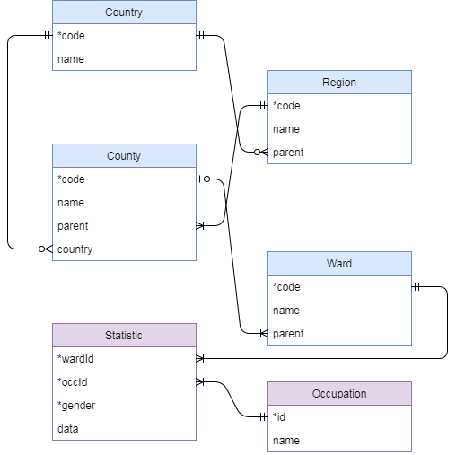

# The 2011 UK Census

In 2011, the UK took a census of all households. We will look at the data for one particular question: "KS608 Occupation".

## Background: UK Geography

The United Kingdom of Great Britain and Northern Ireland (UK) is a country that contains the individual countries England, Wales, Scotland (at the time of writing) and Northern Ireland (but not the Republic of Ireland). The census data for this question comes from the Office of National Statistics (ONS) which is for England and Wales only. Scotland and Northern Ireland have separate statistical offices.

England itself can be divided into 9 regions: 

  * The North West
  * Yorkshire and The Humber
  * The North East
  * The West Midlands
  * The East Midlands
  * The South West
  * The East
  * The South East
  * London

The UK used to be further divided into counties but these are much less important nowadays. In fact there is a mix of counties, unitary authorities and boroughs - 152 in total. These are all called "county-level units" (CLUs).

The smallest relevant unit for political and statistical purposes is the electoral ward, often simply called ward. Wards elect their own councillors (as we have seen) and national statistics are available at a ward level. There were 8570 wards at the time of the 2011 census. For example, the City of Bristol unitary authority contained 35 wards, of which the University of Bristol was in the Cabot ward.

Each statistical unit (ward, county, unitary authority etc.) is assigned a 9-character code by the ONS of the form `Xaabbbbbb` where X is E for England and W for Wales. The first two digits `aa` identify the type of unit: 05 is a ward, 06 a unitary authority; in England only E12 is a region, E08 is a borough (metropolitan), E09 is a borough of London and E10 is a county. The last 6 digits identify the individual unit. Finally, the codes for all of England and Wales are E92000001 and W92000004. 

An interactive online map of the statistical units of the UK is available online at [UK data explorer](http://ukdataexplorer.com/census/) or [DataShine](https://datashine.org.uk). All census data for individual questions is publicly available. (The most interesting data - correlations between questions - is not all openly available due to privacy issues. Researchers can apply to the ONS to get access to particular data sets.)

## Data format

The `census` database has the following schema.

For wards in England, the `parent` FK points at the county table and identifies the CLU (county-level unit) to which the ward belongs. For wards in Wales, the `Ward.parent` column is `NULL` which you need to take into account when working out a JOIN strategy.

## KS608: Occupation

Question KS608 on the 2011 census asked all UK citizens in employment and between the ages of 16 and 74 to classify themselves as one of 9 occupation classes.

  * Have a look at the `Occupation` table in the `census` database to see the 9 occupation classes.

The answers to the question are recorded in the `Statistic` table in the following format. Gender is 1 for women an 0 for men; in the 2011 census these where the only gender options.

    +-----------+-------+--------+------+
    | wardId    | occId | gender | data |
    +-----------+-------+--------+------+
    | E05000001 |     1 |      1 |   54 |
    +-----------+-------+--------+------+

This row records that in ward `E05000001` (Aldersgate), 54 women (gender=1) said that they worked as "Managers, directors and senior officials" (occId=1).

Note how (in the ER diagram) the primary key of the Statistic table is a composite of three columns (wardId, occId, gender). This is exactly what you would expect in a table that has one data value per ward, occupation class and gender.

## Exercises

  1. The university of Bristol is situated in the `Cabot` ward (ward names are not always distinct, but this one is). Find the names and codes of the CLU, region and country containing the Cabot ward (CLU = county level unit = "row in County table").
  2. If you used multiple SQL queries for the last question, do it in one single query now. (In other words, find a join strategy for the tables you need.)
  3. Find the number of women in occupation class 1 (managers etc.) in the Cabot ward. You may use ward code for Cabot that you found in the first query and the occupation id 1 directly - you do not need any JOINs for this query.
  4. For the Stoke Bishop ward (E05002003), list the 9 occupation class names and the number of men in each occupation. Your table should have two columns called `name` and `number`. You can use the provided ward code, you do not need to join on the ward name.

We will soon be able to do more interesting statistical queries on the census data but for that we need SQL's statistical functions which we will learn next week.

Here's a slightly more tricky question to finish off with. It can be done with only the techniques that we have learnt so far.

  * Find all ward names that are not unique, and print them in alphabetical order (only once each).

*There are 400 distinct such names in total (for example, there are 21 wards called 'Abbey') so your query will produce quite a long table. Your query might also take a while to execute, there are faster ways to do this but not with the material we've learnt so far. The table starts "Abbey, Alexandra, All Saints" and ends "Worsley, Wyke, Yarborough".*
