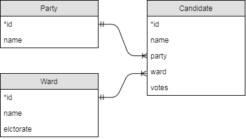

# Bristol elections

In 2014, Bristol held council elections for 24 of its wards. Each ward elected one councillor to represent the ward on the city council. The results are in the `elections` database, with the following schema as you have hopefully just discovered:



From an ER diagram you can derive a _JOIN strategy_, a way of representing all the useful information in a database. For individual queries, you may only need a subset of this information so you can leave off unnecessary parts of the full JOIN strategy. In this case, the following would work:

```
SELECT Candidate.name AS name, Party.name AS party, Ward.name AS ward, Candidate.votes, Ward.electorate
FROM Candidate 
INNER JOIN Party ON Candidate.party = Party.id
INNER JOIN Ward ON Candidate.ward = Ward.id
```

## Exercises

Find SQL statements to answer the following questions. Your answer to each question should be a single query, and you should not hard-code any ids. For example, if a question is about the Labour party, you should use the string `'Labour'` in your query somewhere, not look up the party id and hard-code that in your query.

Although you can answer all the exercises in this section by taking the join strategy and adding clauses where necessary, there is sometimes a quicker way. But if you don't know where to start, consider how you would extract the result you want from the joined table. The WHERE clause determines which rows appear in the result and the SELECT clause picks the columns that appear in the result.

  1. List the names of all parties that stood in the election, ordered alphabetically by name.
  2. List the names of all parties that stood in the Bedminster ward.
  3. How many votes did Labour get in the Stockwood ward?
  4. List the names, parties and number of votes obtained for all candidates in the Southville ward. Order the candidates by number of votes obtained descending (winner comes first).
  5. List the name, party and number of votes obtained for the winner only in the Knowle ward. *(Hint: apart from changing the ward name, you only need one small modification to the statement from the last question. You may assume no ties.)*
