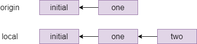

# Git

Git is the defacto standard version control system used throughout CS.
It also lives up to its name as being a _pain_ to use.  Take it
slow and take it as a chance to practice using the Git commandline.

This lab _should_ work fine on pretty much any computer (well... maybe not
Windows) but we'd still recommend completing it in a virtual machine
(mostly because we can test the lab in a virtual machine...).

If you'd like a `Vagrantfile` to base your work on you can use the
following:

```ruby
Vagrant.configure("2") do |config|
  config.vm.box = "generic/debian12"
  config.vm.synced_folder ".", "/vagrant"

  config.vm.provision "shell", inline: <<-SHELL
    apt-get update -y
    apt-get install -y git git-man apt-file
    apt-file update
  SHELL
end
```

## Git documentation

Git comes with *extensive* documentation.  Run:

```
apropos git
```

To see all of it, or run:

```
apropos git -a tutorial
```

To find documentation relating to git and (the `-a`) tutorials.
Read any of the documentation you think might be useful with the `man`
command.

**Task:** There is a man page that documents the _everyday git_
commands you might want to use.  Find it with `apropos` and read it
with the `man` command.

You might also want to read the `gittutorial` pages...


## Configuring your identity

Git is all about tracking changes to source code.  That means it needs
to know *who* made *what* changes.

Run the following two lines to set up git correctly. You only need to do this once when you install git, but not every time you create a new repository.

```
git config --global user.name "YOURNAME"
git config --global user.email "YOUREMAIL"
```

The name and email address aren't actually sent anywhere or
checked... they're just listed with alongside the changes you make to
the code so if somethings wrong later programmers know who to blame
(see `man git-blame`). You can put anything you like here (git will happily accept `-` as your email address, and it does not send you email). 

This alters the *global* git configuration (the settings applied to
*every* git repository you work on), but you can also make these
changes on a repository by repository basis.  Just drop the `--global`
and run the command inside the git repository you want to apply the
changes to.  This is useful if you're _Bruce Wayne_ and need to keep
your public and private development projects separate (or if you do
subcontracted development work).

## For those of you using Vagrant

If you are running a VM on a lab machine, then you would need to
reconfigure git every time vagrant rebuilds the VM, for example when
you log in to a different lab machine. You can put these commands in
your Vagrantfile, like anything else that you want to run when vagrant
(re)builds your box, but they need to be run as the vagrant user and
not the root user. So add the following block to your `Vagrantfile`
just before the `end` line, editing your name and email address
obviously.  Normally vagrant will run these provision blocks as the
system administrator `root`, but you can run it as the normal
`vagrant` user by adding the `privileged: false` keyword.

```ruby
config.vm.provision :shell, privileged: false, inline: <<-SHELL
    git config --global user.name "YOURNAME"
    git config --global user.email "YOUREMAIL"
SHELL
```

If you start getting errors about the git command not being installed:
install it!  If you're using the Debian-based VM the command you need
is `apt` (see `man apt` if you're not familiar with it).  
Some people find having two provisioning blocks a bit messy.  You
could reduce them to just one block, but you'll need to use the `su`
command to ensure that you configure git as the `vagrant` user.

## A sample project and repository

Let's say you want to start developing a C program. Let's make a folder:

```
mkdir project1
cd project1
git init
```

The last command created an empty git repository in a subfolder called `.git`. We can check with `git status` to see whether there are any changes, and git reports `nothing to commit`.

Create a file `main.c`, with your text editor and add some sample content like this (you should be able to copy-paste into your terminal):

```C
// file: main.c
#include <stdio.h>

int main() {
    puts("Hi");
    return 0;
}
```

|||advanced
Which text editor should you use?  It doesn't honestly matter, but it
needs to be able to write plain text documents (those without
formatting---so not Microsoft Word).

The *standard* editor is called `ed`: but don't use it!  It is
designed for back before computers had screens.

The *traditional* programmer editors are `vim` or `emacs`.  You
*should* learn one of them (Jo and Matt would both recommend `vim`)
but they're rather confusing if you've never used a programmers'
editor before.  Absolutely worth it though; just expect to be rather
slow at typing things for a week or two.

Easier editors include `nano` which works on the command line, `gedit`
which is a bit more graphical or Microsoft's `Visual Studio` which can
edit code on remote systems. They're all configurable and you can make
all of them do things like syntax highlighting and code completion.

We don't care what editor you use: but make sure you make it work for
you by configuring it.  You're going to be spending an awful lot of
your degree writing code: a bit of investment in text editor now will
pay dividends later on!

(and I think everyone judges people who are *still* using `nano` in
their final year...)
|||

Do a `git status` and you will see `main.c` in red under _untracked files_ - this is a new file that git does not know about yet. Do `git add main.c` followed by another `git status` and the file is now green under _files to be committed_.

Commit the file with `git commit -m "first file"` or something like that - you need double quotes if you want spaces in your commit message. Try `git status` again and you should see _nothing to commit, working tree clean_ which means git is up to date with your files. Try `git log` and you will see that there is now one commit in the log.

|||advanced
Every git commit must have a commit message. You can either add one
with the `-m` flag, or leave that off and git will drop you into the
system default editor to write one. That is normally vim (the command
to quit is press the escape key then `ZZ`). You can change the default
editor by setting _environment variables_ with command `export EDITOR=nano`.

If you want to keep this setting when you relaunch your shell next time you log in, then the export line has to go in a file called `.profile` in your home directory, which is a file that the bash shell processes when it starts up.

To keep a profile file around when vagrant rebuilds your VM you could
stick a provisioning line in to your vagrantfile to ensure the
`.profile` is updated:
```
echo 'export EDITOR=ed' >>~vagrant/.profile
```
|||

## Ignoring files

Compile your code with `gcc main.c -o program`, and check with
`./program` that it runs and prints _Hi_. (If you get an error that
`stdio.h` doesn't exist, then you have installed gcc but not the C
development libraries  Hint: `man apt-file`.)

If you look at `git status` now, the program file shows as untracked, but we do not want to commit it: the repository works best when you store only your source code, and anyone who needs to can check out a copy and build from there. Among other things this means that people on different platforms e.g. linux and mac, intel and ARM and so on can each compile the version that works for them.

So we want to tell git to ignore the program and changes in it, which we do by creating a file called `.gitignore` and adding an expression on each line to say which file(s) or folders to ignore - you can use `*.o` to select all object code files, for example.

  * Create a file `.gitignore` and add the single line `program` to it.
  * Do another `git status` and notice that while the program is now ignored, the ignore file is marked as new. This file does belong in the repository, so add it and commit it.
  * Check that `git status` reports _clean_ again, and that `git log` contains two commits.

## Commit and checkout

As you develop, you should regularly code, commit, repeat. To practice this, change _Hi_ to _Hello_ in the program, rebuild and run the program, then add and commit the source file again - check with `git status` at the end that you get _clean_ again.

The command `git add .` adds all new and changed files and folders in the current folder in one go, and is typically the quickest way to add things when you want to commit all your changes since the last commit.

Sometimes you want to go back and look at another commit, or undo a commit that broke something - this is when you want a checkout.

  * Use `git log` to show the history of your commits. (When you have more than one screen, `git log |less` lets you scroll.)
  * Note the first 6 or so characters of the commit hash of the commit where you added the ignore file, but before changing _Hi_ to _Hello_. You need at least 6 characters, but only as many so that it's not ambiguous to git which commit you mean.
  * Run `git checkout HASH` where HASH is the 6 or however many you need characters of the commit in question. Git will print a warning about the HEAD pointer.
  * Check the source file, and notice that it is now back on _Hi_.
  * Use `git checkout main` to return to the latest version of your files, and git will set up the HEAD pointer again ready to accept new commits.

|||advanced
If you actually want to undo a commit, then you have two options:

  * `git revert HASH` adds a new commit that returns the files to the state they were before the commit with the given hash. This is safe to use during team development, as it's just adding a new commit. If you have commits A, B and do `git revert B` then you get a new commit C so anyone else using the repository sees a sequence of commits A, B, C; but the state of the files in C is the same as in A.
  * `git reset HASH` undoes commits by moving the HEAD pointer back to the commit with the given hash, but leaves the working copy alone (you can use the `--hard` option to change the files as well). This will break things if you have shared your newer commits with other developers, but it's safe to use to undo changes that you haven't pushed yet (we'll learn about this next time). The effect is as if the commits which you've reset had never happened.

Note: if you want to revert a commit because you accidentally commited a file with secret information, and you've already pushed the commit, then you also have to look up online how to "force push" your changes to erase all traces of the file on github (or other online providers). If the secret file contained any passwords, even if you reverted the commit immediately, then you should consider the passwords compromised and change them at once.
|||

# Part 2: Git forges

In this exercise we will set up and use a git forge account with a
remote provider. The _typical_ ones you usually see for hosting git repositories are:

  * [github.com](https://github.com)
  * [gitlab.com](https://gitlab.com)
  * [bitbucket.org](https://bitbucket.org)
  
But _many_ more exist.  You can even create your own with little more
than an SSH server.  Jo's favourite is one called
[sourcehut](https://sr.ht) but you have to pay for it.

|||advanced
If you do want to build your own git server from scratch it isn't that
hard but you have to muck about with _bare_ git repos (that we don't
cover) and set some funky file permissions.  [Instructions can be found
here for the brave.](https://git-scm.com/book/en/v2/Git-on-the-Server-Getting-Git-on-a-Server)
|||

This exercise is based on GitHub, as it is the most popular provider, but you can use one of the other two if you want as well---although the web user interface and some advanced features are different, interacting with all three on the command line is identical and all three offer unlimited private and public repositories (within reason).

## Set things up

Go to [github.com](https://github.com) and register with a username, an e-mail address and a password. You might have to click a confirmation link in an e-mail sent to you.

We are going to use git over SSH, so you need to let git know your public key (remember, you never give anyone your private key!). Click the icon in the top right corner of the screen that represents your avatar (you can of course set a custom one if you like) and choose _Settings_ in the menu, then on the settings page choose _SSH and GPG keys_.

Choose _New SSH key_, and paste your SSH public key in the `Key` box
(you created one last week, see `man ssh-keygen`). Give your key a
title if you like, then add it with the green button. Github supports
all common SSH key formats, but will warn you if you do something
silly like upload a private key or a key in an outdated and weak
cipher.  Some providers (Bitbucket) insist you use a specific type of
key (usually `ed25519`): add the appropriate flag when generating the
key to create it (`-t ed25519`) if you want that.

|||advanced
If you have many devices (desktop, laptop) that you work from and many servers (github, gitlab, lab machine etc.) that you connect to, how do you manage keys?

Whilst ising the same public key for different services is not exactly
a security problem: even if one service gets hacked and you connect to
it while it's under the hacker's control, that does not leak your
private key; it feels a bit icky.  Generating keys is easy and it is
barely any more work to have separate keys per server and per machine
you use.

However, reusing public keys can be a privacy problem, because every service that you use the same public key (or e-mail address, or phone number etc.) can potentially work with the others to know that you are the same individual. It is no problem to use different keypairs for different services, in which case you probably want a block in your `~/.ssh/config` file with something like 

```
Host github.com
    User git
    IdentityFile ~/.ssh/github.com.key.or.whatever.you.called it.
```

Search the manual pages for `ssh_config` for full configuration options.
|||

We are assuming that you will be running the git commands in the rest of this section on an VM, either on your machine or on a lab machine, however if you have git installed on your own machine directly (which is a good idea) then you can run this exercise there too.

## A note on naming

The name of the main branch changes: it used to be called `master`.
You may see the default branch named as either `master` or `main`, or  something else entirely. So long as you are consistent, the name of the
default branch doesn't matter at all (and you can configure it if you have a
preference), and you just need to know that in these exercises we will use `main` 
to refer to the default branch and you should substitute that for your own default 
branch name if it is different.

## Create a repository

On the main page, you should see an empty _Repositories_ bar on the left, with a new button. Use that to create a repository, on the next page give it a name and tick the _Add a README file_ box.

On the repository page, there is a green _Code_ button. Clicking that opens a box with three tabs: _HTTPS_, _SSH_ and _GitHub CLI_.

Each repository has a two-part name: the first part is the owner's github username, the second part is the repository name. For example, the repository for this unit is called `cs-uob/COMSM0085`. There are two ways to interact with a remote repository:

  * Via HTTPS. This is ok if you are just cloning a public repository, as it does not require any authentication. To interact with a private repository or to push files, HTTPS requires username/password authentication, and we can do better than that.
  * Via SSH, using keys. This is the recommended way to use Git.

Click the SSH tab and copy the URL there - it should be something like `git@github.com:USERNAME/REPONAME.git`.

On the command line, run the command `git clone git@github.com:USERNAME/REPONAME.git` where you replace USERNAME and REPONAME with the parts from the SSH tab of your repository. Git clones your repository and puts the content in a subfolder named after the repository name - you can change this by providing a different folder name as an extra command-line argument to `git clone`, or you can just move or rename the folder later on.

_Note: certain OS/ISP/DNS combinations might get you "resource temporarily unavailable" when you try and access github via ssh. The problem is that the actual address is `ssh.github.com` and not all set-ups correctly pass on the redirection when you try and connect to github directly. If you are experiencing this error, you can either use `ssh.github.com` in place of `github.com`, or add an entry in your `~/.ssh/config` file as follows (if you have to create this file first, make sure it is not writable by anyone except yourself or ssh will refuse to accept it):_

    Host github.com
      Hostname ssh.github.com
      Port 22

Go to that folder, and try `git remote show origin`. Here, `origin` is the default name of a _remote_, and the result should look a bit like this:

```
* remote origin
  Fetch URL: git@github.com:USERNAME/REPONAME
  Push  URL: git@github.com:USERNAME/REPONAME
  HEAD branch: main
  Remote branch:
    main tracked
  Local branch configured for 'git pull':
    main merges with remote main
  Local ref configured for 'git push':
    main pushes to main (up to date)
```

The bits about `main` are to do with branches, which we will discuss in another activity in more detail. 

|||advanced
You can have several remotes with different names - for example if you fork (create your own copy of someone else's repository) then you get the original one as a second remote named _upstream_, so you can share changes back with them - this is the way you create new content for the [CSS website](https://cssbristol.co.uk) for example.

You can also use folders as remotes: if you want to practice resolving merge conflicts, you could do the following:

```
mkdir remote
cd remote
git init --bare
cd ..
mkdir user1
git clone remote user1
mkdir user2
git clone remote user2
```

This gets you a remote and two "users" in different folders to play with. The remote was set up with `--bare` so that it does not contain a working copy, but acts as a pure repository.

You can now `cd user1` to simulate user 1 doing work, and can fetch/push/pull as described below. (Ignore warnings about "upstream", they will go away once you have committed a file to the repository.) Then you can `cd ../user2` to switch to a second working copy, which you can pretend is another user on another machine.

If you want to adjust the user names for the commits, then running `git config user.name "YOURNAME"` and `git config user.email "YOUREMAIL"` without the `--global` option from last time changes the settings just for one repository.
|||

Do a `git status` and note that a new line appears compared to last activity:

```
Your branch is up to date with 'origin/main'.
```

This line comes in four versions:

  * Up to date: there have been no commits on your local or the remote repository since you last synchronised.
  * Ahead of remote: you have made commits locally that you have not yet pushed to the remote.
  * Behind remote: someone else, or you on a different computer, have made commits to the remote that you do not have on this computer yet.
  * Diverged from remote: both your computer and the remote have had different commits since the last time you synchronised. 

## Practice the push workflow

For this exercise, you should work in pairs or larger groups.  Need
someone to work with?  Ask the person you're sitting next to.

One person creates a private repository (tick the box to add a README file) and adds everyone else in the group to it. You all need to have an account with the same provider for this to work.

  * On Github, the way to add people to a repository is on the repository page: choose _Settings_ in the top menu, then _Manage access_. Here you can press _Invite a collaborator_ and enter their Github username. This causes Github to send them an e-mail with a link they need to click to accept the invitation and be added to the repository. _Note: you must be logged in to github when you click the link on the invitation e-mail, otherwise you will get an error message._

Everyone `git clone`s the repository to their own Debian VM (or their own machine directly).

Everyone does the following, one person at a time doing all steps (coordinate among each other):

  1. Imagine that it is mid-morning and you are starting on a day's coding.
  2. First, make sure your terminal is in the folder with your working copy, and type `git fetch`.
      * If you get no update, then there were no changes on the remote since your last fetch and you are ready to start coding. (This should happen to the first person to do this step.)
      * If you get output, then there were changes on the remote. Do a `git status` to see details (everyone except the first person should see this). Notice the line `behind origin/main ... can be fast-forwarded.` which means you just need to `git pull` and you will get the latest version of the files. Do a `git log` too to see the last person's commit message.
  3. Do some coding: make a change to the repository - add or change a file, then commit your changes. You can use `nano FILENAME` to create and edit a file in your terminal, if you have installed it as described in the last activity.
  4. Run the following push workflow to push your changes to the remote:
     1.  Do a `git fetch` to see if there were any remote changes (there shouldn't be, for this exercise).
     2.  Do a `git status` and make sure you are `ahead of origin`, not `diverged`.
     3. Do a `git push` to send your changes to the remote.

You can now code as a team, as long as only one person at a time is working - clearly not ideal.

## Resolve a fake conflict, part one

Produce a "fake" conflict as follows:

  1. Two team members make sure they are `up to date` with their working copies (do a `git pull`, then `git status`). This represents you both starting coding in the morning.
  2. One member adds or changes one file, then commits this change and pushes it by running the whole push workflow (fetch, status - check you're ahead, push).
  3. At the same time as the first member is doing step 2, the second member adds or changes a different file, then commits this change. This represents two team members working in parallel, with the member one being the first one to complete their work and push a commit back to the remote.
  4. The second member starts the push workflow with `git fetch`, then `git status`. Notice you have `diverged`. (If you were to try to `git push`, with or without fetching this would produce an error.)

The commit graph of member two looks something like this:


One way to resolve this conflict is a _rebase_, which is pretending that member two had actually fetched the `one` commit before starting their own work. The command for this which member two types is `git rebase origin/main` which means _pretend that everything in origin/main happened before I started my local changes_ and gives the following graph:



Indeed, if member two does a `git status` after the rebase, they will see `ahead of origin/main by 1 commit` and they can now `git push` to send their local changes to the remote repository.

Different companies and teams have different opinions on when a rebase makes sense: some places forbid rebasing like this entirely, at least for work that is genuninely shared between different people. There is more or less a general consensus that you should not rebase when different people were editing the same files, but it is a technique worth knowing about for conflicts like the one you just created where different people have edited different files, as it makes for a cleaner commit graph.

## Fake conflicts, part two

The other way to fix conflicts - and the only one that some people will use - is a merge. Let's do another fake conflict, but resolve it with a merge this time:

  1. Two team members both get their repositories up to date with the remote. If you have just followed the instructions above then team member one has to `git pull` and team member two is already up to date because they have just pushed; both team members should check with `git fetch` then `git status` that they are `up to date`.
  2. Like before, team member one edits one file, commits it and does the whole push workflow (fetch, status - check you're ahead, push). The second team member at the same time, without another fetch, edits a different file and commits.
  3. The second team member starts the push workflow: fetch, status - notice you've `diverged`.

The second member's commit graph looks similar to the previous one before the rebase, perhaps with more commits in place of the _initial_ one.

The second member is about to do a merge, which can either succeed (as it should here, because different people edited different files) or fail with a merge conflict (for example if different people edited the same file). If a merge succeeds, then git will make a merge commit and will drop them into their system's default editor, which is normally `vi`. Because we don't want to learn that right now, the second member should type `echo $EDITOR` in their shell and see what they get - if they get `nano` then they're fine, if they get an empty line then they should do `export EDITOR=nano`.

The second team member types `git pull`. Since this is a fake conflict (different files), this gets you into your editor, and you can see that on the first line is a suggested commit message starting with `Merge branch main`, which it is conventional to accept without changes - exit your editor again. Git replies `Merge made by the recursive strategy.` and your commit graph now looks something like this (the `...` stands for the last commit from the previous section):


## Resolving a real conflict

And next, we'll practice dealing with a real conflict, where two people have edited the same file.

  1. Two team members get their repositories synchronised again: everyone does a `git pull`.
  2. Team member one creates a file called `README.md` or edits it if it already exists, and adds a line like `Created by NAME` with their own name. Then they commit this change and run the push workflow: `git fetch`, `git status`, check they're `ahead`, `git push` to the remote.
  3. Team member two, without fetching the latest commit, creates the same `README.md` file and adds a line `Created by NAME2` and commits this to their local repository. This simulates two people working on the same files in parallel since they both last fetched, and one of them (member one in this case) is the first to get their changes back to the remote.
  4. Team member two starts the push workflow: `git fetch`, `git status` and notice that you have `diverged` again.
  5.  Run `git pull` as member two. You should see the following message:

```
CONFLICT (add/add): Merge conflict in README.md
Auto-merging README.md
Automatic merge failed; fix conflicts and then commit the result.
```

Open the file, for example `nano README.md` and notice that git has annotated it:

    <<<<<<< HEAD
    Created by NAME2.
    =======
    Created by NAME1.
    >>>>>>> b955a75c7ca584ccf0c0bddccbcde46f445a7b30

The lines between `<<<<<<< HEAD` and `=======` are the local changes (team member two) and the ones from `======` to `>>>>>> ...` are the ones in the commit fetched from the remote, for which the commit id is shown.

Member two now has to resolve the conflict by editing the file to produce the version they would like to commit. For example, you could remove all the offending lines and replace them with `Created by NAME1 and NAME2.`

Member two can now do the following:

  * `git add README.md` (or whatever other files were affected).
  * `git commit`. You could give a message directly, but a commit without a `-m` drops you into your editor and you'll see that git is suggesting `Merge branch main ...` as a default message here. It is conventional to leave this message as it is, just exit your editor without any changes.
  * Run another push workflow: `git fetch`, `git status` and notice you are now `ahead by 2 commits`: the first one was the work you did, the second is the merge commit. You're ahead, so finish the workflow with `git push`.

Your commit graph looks the same as for the last merge that you did. 

If you look at the repository's page on Github (`https://github.com/USERNAME/REPONAME`, where `USERNAME` is the name of the user who created the repository), then you can click on _Insights_ in the top bar then _Network_ on the left menu to see the commit history for the repository as a graph. Hovering over a commit node shows the committer, the message and the commit hash - and clicking on a node takes you to a page where you can see which changes were made in this commit.

On the main Github page for the repository, you can also click the clock icon with a number in the top right (on a wide enough screen it also shows the word _commits_) to go to a page showing all the commits on your repository in chronological order.

# Working with others

In this activity you will practice Git the way it is used in real teams. You will need to form a group for this activity, ideally more than two students.

## Set-up

One member makes a Git repository on one of the online providers, adds the other team members and shares the cloning URL. Everyone clones the repository.

The repository must have at least one commit for the following to work. This condition is satisfied if you chose your provider's option to create a readme file; if not then make a file now, commit it and push.

## The develop branch

By default, your repository has one branch named `main`. But you don't want to do your work on this branch directly. Instead, one team member creates a `develop` branch with the command

    git checkout -b develop

The team member who created the develop branch should now make a commit on it.

This branch currently exists only in their local repository, and if they try and push they would get a warning about this.
What they need to do is

    git push --set-upstream origin develop

This adds an "upstream" entry on the local develop branch to say that it is linked to the copy of your repository called `origin`, which is the default name for the one you cloned the repository from.

You can check this with `git remote show origin`, which should display among other things:

    Remote branches:
      develop tracked
      main  tracked
    Local branches configured for 'git pull':
      develop merges with remote develop
      main  merges with remote main
    Local refs configured for 'git push':
      develop pushes to develop (up to date)
      main  pushes to main  (up to date)

Everyone else can now `git pull` and see the branch with `git branch -a`, the `-a` (all) option means include branches that only exist on the remote. They can switch to the develop branch with `git checkout develop`, which should show:

    Branch 'develop' set up to track remote branch 'develop' from 'origin'.
    Switched to a new branch 'develop'

## Feature branches

Every team member now independently tries the following:

  - Make a new branch with `git checkout -b NAME`, choosing a unique name for their feature branch.
  - Make a few commits on this branch.
  - Push your feature branch with `git push --set-upstream origin NAME`.
  - Make a few more commits.
  - Do a simple `git push` since you've already linked your branch to `origin`.

Since everyone is working on a different branch, you will never get a conflict this way.

Anyone who is a project member can visit the github page can see all the feature branches there, but a normal `git branch` will not show other people's branches that you've never checked out yourself. Instead, you want to do `git branch -a`  again that will show you all the branches, with names like `remotes/origin/NAME` for branches that so far only exist on the origin repository. You can check these out like any other branch to see their contents in your working copy.

## Merging

When a feature is done, you want to merge it into develop. Everyone should try this, the procedure for this is

  1. Commit all your changes and push.
  2. Fetch the latest changes from origin (a simple `git fetch` does this).
  3. `git checkout develop`, which switches you to the develop branch (the changes for your latest feature will disappear in the working copy, but they're still in the repository). You always merge into the currently active branch, so you need to be on `develop` to merge into it.
  4. `git status` to see if someone else has updated develop since you started your feature. If so, then `git pull` (you will be _behind_ rather than _diverged_ because you have not changed develop yourself yet).
  5. `git merge NAME` with the name of your feature branch.
  6. Resolve conflicts, if necessary (see below).
  7. `git push` to share your new feature with the rest of the team.

If no-one else has changed `develop` since you started your branch, or if you have only changed files that no-one else has changed, then the merge might succeed on the first attempt. It's still a good idea to check that the project is in a good state (for example, compile it again) just in case, and fix anything that's broken on the develop branch.

If the merge fails with a conflict, then you need to manually edit all the conflicted files (git will tell you which ones these are, do `git status` if you need a reminder) and `git commit` again.

The workflow for merging and resolving conflicts is essentially the same as the one from the last session, but since everyone is developing on a separate branch, the only time when you have to deal with a possible merge conflict is when you are merging your changes into develop - your own branches are "private" and you don't have to worry about hitting a conflict if you quickly want to commit and push your changes as the last thing you do before going home at the end of a long day's work.

## Pull requests

Pull requests are not a feature of the git software itself, but of the online providers. They let a team discuss and review a commit before merging it into a shared branch such as develop or main. Depending on the provider, branches can also be protected or assigned owners so that only the branch owner or developers with the right permissions can commit on certain branches.

The procedure for merging with a pull request on github, which you should try out:

  - Commit and push your feature branch.
  - On github.com in your repository, choose _Pull Requests_ in the top bar, then _New Pull Request_ .
  - Set the _base_ branch as the one you want to merge into, e.g. develop, and the _compare_ branch as the one with your changes. Select _Create Pull Request_.
  - Add a title and description to start a discussion, then press _Create Pull Request_ again to create the request.

Anyone in the team can now go to _Pull Requests_ in the top bar of the repository page and see the open requests. You can either comment on them, or if it is your role in the team to approve the request for this branch, you can approve the pull request which creates a merge.

Since a pull request is linked to a branch, you can use it for code review as follows:

  1. A developer creates a feature branch and submits a pull request.
  2. The reviewer looks at the request. If they find bugs or other problems, they add a comment to the discussion.
  3. The developer can address reviewer comments by making a new commit on their feature branch and pushing it, which automatically gets added to the discussion.
  4. When the reviewer is happy, they approve the request which merges the latest version of the feature branch into the base branch (for example `develop`).

There is just one complication left. Suppose the following happens:

  - Your project starts out with commit `develop-1` setting up the initial version of the develop branch. Imagine there are two files, A and B.
  - You create a feature branch and make a commit `feature-1` which changes only file B.
  - In the meantime, someone else makes a feature that changes file A, and merges it as `develop-2` to the develop branch.

You are now in the situation that `develop-2` has (new A, old B) and your `feature-1` has (old A, new B). Neither of these is what you want, you presumably want (new A, new B). We have met this situation before, but without branches. Graphically:


The solution here is to _rebase_ your branch onto the latest commit on develop with `git rebase develop` and fix any conflicts that that causes, which produces the following situation:


If you now try and push your feature branch, you might get an error because the version of your feature branch on the origin repository still has the old version. The solution here is to force the push, which overwrites the old version, with

    git push --force origin BRANCHNAME

This is a _think before you type_ kind of command because it can break things for other developers if you do it on a shared branch. The basic safety rules are:

  - Only rebase on _private_ branches.
  - Only force push on _private_ branches, and only if it is absolutely necessary (for example to tidy up a rebase).

A private branch is one that you know no-one else is working on, for example your own feature branches.

If you ever get into a situation where you need to rebase or force push on a shared branch such as develop or main, you generally need to make sure that everyone on the team knows what is going on, synchronises their repositories both before and after the dangerous operation, and does not make any commits or pushes while someone is working on it - basically they need, in concurrency terms, an exclusive lock on the whole repository while doing this operation.

This is one reason why the main and develop branches are kept separate - and some workflows even include a third branch called `release`. If merges into main or release only ever come from the develop branch, then a situation where you need to rebase these branches can never happen.

To summarise, the pull request workflow is:

  1. Commit and push your changes.
  2. If necessary, rebase your feature branch on the develop branch.
  3. Create a pull request.
  4. If necessary, participate in a discussion or review and make extra commits to address points that other developers have raised.
  5. Someone - usually not the developer who created the pull request - approves it, creating a merge commit in develop (or main).

