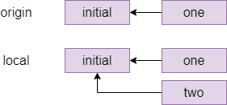
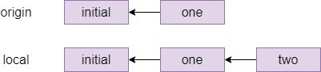
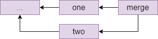

# Git, part 2

In this exercise we will set up and use a git account on a remote provider. The "big 3" for hosting git repositories are:

  * [github.com](https://github.com)
  * [gitlab.com](https://gitlab.com)
  * [bitbucket.org](https://bitbucket.org)

This exercise is based on github, as this is the most popular provider, but you can use one of the other two if you want as well (the slides show the equivalent version for gitlab) - although the web user interface and some advanced features are different, interacting with all three on the command line is identical and all three offer unlimited private and public repositories (within reason).

## Set things up

Go to [github.com](https://github.com) and register with a username, an e-mail address and a password. You might have to click a confirmation link in an e-mail sent to you.

We are going to use git over SSH, so you need to let git know your public key (remember, you never give anyone your private key!). Click the icon in the top right corner of the screen that represents your avatar (you can of course set a custom one if you like) and choose _Settings_ in the menu, then on the settings page choose _SSH and GPG keys_.

Choose _New SSH key_, and paste your SSH public key in the `Key` box - this is the file `~/.ssh/id_ed25519.pub` that you created in the last activity. (The file `id_ed25519` without `.pub` in the same folder is your private key, and you never paste that anywhere.) Give your key a title if you like, then add it with the green button. Github supports all common SSH key formats, but will warn you if you do something silly like upload a private key or a key in an outdated and weak cipher.

|||advanced
If you have many devices (desktop, laptop) that you work from and many servers (github, gitlab, lab machine etc.) that you connect to, how do you manage keys?

Using the same public key for different services is not a security problem: even if one service gets hacked and you connect to it while it's under the hacker's control, that does not leak your private key. Unlike passwords, you can safely reuse public keys.

However, reusing public keys can be a privacy problem, because every service that you use the same public key (or e-mail address, or phone number etc.) can potentially work with the others to know that you are the same individual. It is no problem to use different keypairs for different services, in which case you probably want a block in your `~/.ssh/config` file with something like 

```
Host github.com
    IdentityFile FILENAME
```

to tell SSH that the key for this host is named something other than the default `id_ed25519`.

You can copy the same private key to different devices that you own, or you can set up a different key for each device and add the public keys of all of them to github and the different providers. This is a security/convenience trade-off, the security angle being what happens if one of your devices gets stolen or otherwise compromised.

If you are running this exercise on an alpine VM hosted on a lab machine, then because the lab machine does not belong to you, I would not use the same private key on your VM than on your own computer, especially not if you use your own computer to access other services than the university. If you want to use Github both from your own machine and from the lab machines, then create a separate keypair for each and enrol both the public keys with Github.
|||

I am assuming that you will be running the git commands in the rest of this section on an alpine linux VM, either on your machine or on a lab machine, however if you have git installed on your own machine directly (which is a good idea) then you can run this exercise there too.

## A note on naming

TL;DR: You may see the default branch named as either `master` or `main`, or more
rarely something else entirely. So long as you are consistent, the name of the
default branch doesn't matter at all (and you can configure it if you have a
preference), and you just need to know that in these exercises we will use `master` 
to refer to the default branch and you should substitute that for your own default 
branch name if it is different.

### Long version: 

When git first appeared, whenever you created a repository you started with one branch called `master`. Different workflows and branch naming conventions appeared over time (we will see one of these in the next activity).

As far as git is concerned, a branch name is just a string and any other name would do just as well (as long as it does not contain spaces, slashes or a few other special characters). As far as humans go, in 2020 it came to developers' attention that some people consider the term `master` as used in some contexts of engineering in general and computing in partciular to be problematic. Specifically, a system where several components perform similar roles but one of them is the authoritative one in case of discrepancy has historically been called a _master/slave_ system.

The git developers' first reaction to complaint about this was to make it easier to choose a different name for your first branch; the latest version of git prints a message on how to do this when you create a repository (the configuration setting is `init.defaultBranch`) and the online providers such as github offer a text field for this too. The term `main` seems to be the most popular alternative name for the first branch. Another contender for workflows which use a `develop` branch anyway is to use that as the initial branch. 

While some in the community dispute that merely referring to the _concept_ of slavery is legitimately problematic, there has also been some debate about whether the name "master" in git even traces back to _master/slave_ or instead stems from another, less problematic use of word e.g. the phrase _master copy/master recording_ from the music industry - the most authoritative source on the matter is [git rev news 65, July 2020](https://git.github.io/rev_news/2020/07/29/edition-65/) from the git developers themselves, which also states that a change of the default branch name could happen in Git 3.0 (the version installed in Alpine at the time of writing is 2.38.3).

There is another line of argument that the word _master_ as a default branch name (and thus something developers will refer to a lot) is somehow inherently problematic even if it came from a different origin than _master/slave_. This is a complicated issue as, among other things, half the cohort taking Software Tools is probably on a _Master's Degree_ and one of the criteria for a first-class mark is showing _mastery_ of the unit material - all terms that will be much harder to change than a simple repository name which is one line of commands to change. Git does not care what your branches are called, after all -- one string is as good as another (as long as it doesn't contain special characters or spaces).

A fresh installation of git will still call the branch `master` unless you change a configuration setting, and any book, tutorial, forum or stackexchange post online written about git before around mid-2020 will refer to `master`, so there is no way around knowing that in the context of git, the term `master` refers to a branch with a particular role, but as a future developer you should also have an understanding of the community and conventions around your tools, and you should definitely know that there is a currently ongoing discussion around this term.

We have decided to go with `master` for this unit because you will encounter the term `master` in git itself and in a lot of existing repositories and documentation (including the official [git book](https://git-scm.com/book/en/v2) at the time of writing).

For your own repositories, you are free to choose whatever name you like, and you can configure this with the command

    git config --global init.defaultBranch NAME

and then follow the rest of the git exercises, mentally replacing `master` by `main` or your choice of other name. 

When you create a repository on github, the default name you get depends on your settings, which seems to depend on when you created your account - if you create an account today, you will get `main` as the default name but on an older account you will still get `master`. The page you want to check while logged in to github is https://github.com/settings/repositories; if you get `main` as your default then please either alter it or use that in the rest of this tutorial.

To finish with a quote from the git book:

> The "master" branch in Git is not a special branch. It is exactly like any other
> branch. The only reason nearly every repository has one is that the git init
> command creates it by default and most people don't bother to change it.

## Create a repository

On the main page, you should see an empty _Repositories_ bar on the left, with a new button. Use that to create a repository, on the next page give it a name and tick the _Add a README file_ box.

On the repository page, there is a green _Code_ button. Clicking that opens a box with three tabs: _HTTPS_, _SSH_ and _GitHub CLI_.

Each repository has a two-part name: the first part is the owner's github username, the second part is the repository name. For example, the repository for this unit is called `cs-uob/COMS10012`. There are two ways to interact with a remote repository:

  * Via HTTPS. This is ok if you are just cloning a public repository, as it does not require any authentication. To interact with a private repository or to push files, HTTPS requires username/password authentication, and we can do better than that.
  * Via SSH, using keys. This is the recommended way to use Git.

Click the SSH tab and copy the URL there - it should be something like `git@github.com:USERNAME/REPONAME.git`.

On the command line, run the command `git clone git@github.com:USERNAME/REPONAME.git` where you replace USERNAME and REPONAME with the parts from the SSH tab of your repository. Git clones your repository and puts the content in a subfolder named after the repository name - you can change this by providing a different folder name as an extra command-line argument to `git clone`, or you can just move or rename the folder later on.

_Note: certain OS/ISP/DNS combinations might get you "resource temporarily unavailable" when you try and access github via ssh. The problem is that the actual address is `ssh.github.com` and not all set-ups correctly pass on the redirection when you try and connect to github directly. If you are experiencing this error, you can either use `ssh.github.com` in place of `github.com`, or add an entry in your `~/.ssh/config` file as follows (if you have to create this file first, make sure it is not writable by anyone except yourself or ssh will refuse to accept it):_

    Host github.com
      Hostname ssh.github.com
      Port 22

|||advanced
Notice that git did not ask for your username. It can determine your identity from your public key, as that is stored in your user account.

In the last activity, we configured a name and e-mail address for git commits. When you push commits to github, this information will appear in every commit, but it does not have to match your Github account information - Github will let you push commits with any name you like, as you might be pushing them on behalf of someone else.
|||

Go to that folder, and try `git remote show origin`. Here, `origin` is the default name of a _remote_, and the result should look a bit like this:

```
* remote origin
  Fetch URL: git@github.com:USERNAME/REPONAME
  Push  URL: git@github.com:USERNAME/REPONAME
  HEAD branch: master
  Remote branch:
    master tracked
  Local branch configured for 'git pull':
    master merges with remote master
  Local ref configured for 'git push':
    master pushes to master (up to date)
```

The bits about `master` are to do with branches, which we will discuss in another activity in more detail. _You might see `main` instead of master, in which case please use `main` instead of `master` from now on._

|||advanced
You can have several remotes with different names - for example if you fork (create your own copy of someone else's repository) then you get the original one as a second remote named _upstream_, so you can share changes back with them - this is the way you create new content for the [CSS website](https://cssbristol.co.uk) for example.

You can also use folders as remotes: if you want to practice resolving merge conflicts, you could do the following:

```
mkdir remote
cd remote
git init --bare
cd ..
mkdir user1
git clone remote user1
mkdir user2
git clone remote user2
```

This gets you a remote and two "users" in different folders to play with. The remote was set up with `--bare` so that it does not contain a working copy, but acts as a pure repository.

You can now `cd user1` to simulate user 1 doing work, and can fetch/push/pull as described below. (Ignore warnings about "upstream", they will go away once you have committed a file to the repository.) Then you can `cd ../user2` to switch to a second working copy, which you can pretend is another user on another machine.

If you want to adjust the user names for the commits, then running `git config user.name "YOURNAME"` and `git config user.email "YOUREMAIL"` without the `--global` option from last time changes the settings just for one repository.
|||

Do a `git status` and note that a new line appears compared to last activity:

```
Your branch is up to date with 'origin/master'.
```

This line comes in four versions:

  * Up to date: there have been no commits on your local or the remote repository since you last synchronised.
  * Ahead of remote: you have made commits locally that you have not yet pushed to the remote.
  * Behind remote: someone else, or you on a different computer, have made commits to the remote that you do not have on this computer yet.
  * Diverged from remote: both your computer and the remote have had different commits since the last time you synchronised. 

## Practice the push workflow

For this exercise, you should work in pairs or larger groups.

One person creates a private repository (tick the box to add a README file) and adds everyone else in the group to it. You all need to have an account with the same provider for this to work.

  * On Github, the way to add people to a repository is on the repository page: choose _Settings_ in the top menu, then _Manage access_. Here you can press _Invite a collaborator_ and enter their Github username. This causes Github to send them an e-mail with a link they need to click to accept the invitation and be added to the repository. _Note: you must be logged in to github when you click the link on the invitation e-mail, otherwise you will get an error message._
  * On Gitlab, the place to add people is under _Members_ in the left menu on the repository page, and there are different access levels - give them  _Maintainer_ access to let them push commits.

Everyone `git clone`s the repository to their own alpine VM (or their own machine directly).

Everyone does the following, one person at a time doing all steps (coordinate among each other):

  1. Imagine that it is mid-morning and you are starting on a day's coding.
  2. First, make sure your terminal is in the folder with your working copy, and type `git fetch`.
      * If you get no update, then there were no changes on the remote since your last fetch and you are ready to start coding. (This should happen to the first person to do this step.)
      * If you get output, then there were changes on the remote. Do a `git status` to see details (everyone except the first person should see this). Notice the line `behind origin/master ... can be fast-forwarded.` which means you just need to `git pull` and you will get the latest version of the files. Do a `git log` too to see the last person's commit message.
  3. Do some coding: make a change to the repository - add or change a file, then commit your changes. You can use `nano FILENAME` to create and edit a file in your terminal, if you have installed it as described in the last activity.
  4. Run the following push workflow to push your changes to the remote:
     1.  Do a `git fetch` to see if there were any remote changes (there shouldn't be, for this exercise).
     2.  Do a `git status` and make sure you are `ahead of origin`, not `diverged`.
     3. Do a `git push` to send your changes to the remote.

You can now code as a team, as long as only one person at a time is working - clearly not ideal.

## Resolve a fake conflict, part one

Produce a "fake" conflict as follows:

  1. Two team members make sure they are `up to date` with their working copies (do a `git pull`, then `git status`). This represents you both starting coding in the morning.
  2. One member adds or changes one file, then commits this change and pushes it by running the whole push workflow (fetch, status - check you're ahead, push).
  3. At the same time as the first member is doing step 2, the second member adds or changes a different file, then commits this change. This represents two team members working in parallel, with the member one being the first one to complete their work and push a commit back to the remote.
  4. The second member starts the push workflow with `git fetch`, then `git status`. Notice you have `diverged`. (If you were to try to `git push`, with or without fetching this would produce an error.)

The commit graph of member two looks something like this:



One way to resolve this conflict is a _rebase_, which is pretending that member two had actually fetched the `one` commit before starting their own work. The command for this which member two types is `git rebase origin/master` which means _pretend that everything in origin/master happened before I started my local changes_ and gives the following graph:



Indeed, if member two does a `git status` after the rebase, they will see `ahead of origin/master by 1 commit` and they can now `git push` to send their local changes to the remote repository.

Different companies and teams have different opinions on when a rebase makes sense: some places forbid rebasing like this entirely, at least for work that is genuninely shared between different people. There is more or less a general consensus that you should not rebase when different people were editing the same files, but it is a technique worth knowing about for conflicts like the one you just created where different people have edited different files, as it makes for a cleaner commit graph.

## Fake conflicts, part two

The other way to fix conflicts - and the only one that some people will use - is a merge. Let's do another fake conflict, but resolve it with a merge this time:

  1. Two team members both get their repositories up to date with the remote. If you have just followed the instructions above then team member one has to `git pull` and team member two is already up to date because they have just pushed; both team members should check with `git fetch` then `git status` that they are `up to date`.
  2. Like before, team member one edits one file, commits it and does the whole push workflow (fetch, status - check you're ahead, push). The second team member at the same time, without another fetch, edits a different file and commits.
  3. The second team member starts the push workflow: fetch, status - notice you've `diverged`.

The second member's commit graph looks similar to the previous one before the rebase, perhaps with more commits in place of the _initial_ one.

The second member is about to do a merge, which can either succeed (as it should here, because different people edited different files) or fail with a merge conflict (for example if different people edited the same file). If a merge succeeds, then git will make a merge commit and will drop them into their system's default editor, which is normally `vi`. Because we don't want to learn that right now, the second member should type `echo $EDITOR` in their shell and see what they get - if they get `nano` then they're fine, if they get an empty line then they should do `export EDITOR=nano`.

The second team member types `git pull`. Since this is a fake conflict (different files), this gets you into your editor, and you can see that on the first line is a suggested commit message starting with `Merge branch master`, which it is conventional to accept without changes - exit your editor again. Git replies `Merge made by the recursive strategy.` and your commit graph now looks something like this (the `...` stands for the last commit from the previous section):



## Resolving a real conflict

And next, we'll practice dealing with a real conflict, where two people have edited the same file.

  1. Two team members get their repositories synchronised again: everyone does a `git pull`.
  2. Team member one creates a file called `README.md` or edits it if it already exists, and adds a line like `Created by NAME` with their own name. Then they commit this change and run the push workflow: `git fetch`, `git status`, check they're `ahead`, `git push` to the remote.
  3. Team member two, without fetching the latest commit, creates the same `README.md` file and adds a line `Created by NAME2` and commits this to their local repository. This simulates two people working on the same files in parallel since they both last fetched, and one of them (member one in this case) is the first to get their changes back to the remote.
  4. Team member two starts the push workflow: `git fetch`, `git status` and notice that you have `diverged` again.
  5.  Run `git pull` as member two. You should see the following message:

```
CONFLICT (add/add): Merge conflict in README.md
Auto-merging README.md
Automatic merge failed; fix conflicts and then commit the result.
```

Open the file, for example `nano README.md` and notice that git has annotated it:

    <<<<<<< HEAD
    Created by NAME2.
    =======
    Created by NAME1.
    >>>>>>> b955a75c7ca584ccf0c0bddccbcde46f445a7b30

The lines between `<<<<<<< HEAD` and `=======` are the local changes (team member two) and the ones from `======` to `>>>>>> ...` are the ones in the commit fetched from the remote, for which the commit id is shown.

Member two now has to resolve the conflict by editing the file to produce the version they would like to commit. For example, you could remove all the offending lines and replace them with `Created by NAME1 and NAME2.`

Member two can now do the following:

  * `git add README.md` (or whatever other files were affected).
  * `git commit`. You could give a message directly, but a commit without a `-m` drops you into your editor and you'll see that git is suggesting `Merge branch master ...` as a default message here. It is conventional to leave this message as it is, just exit your editor without any changes.
  * Run another push workflow: `git fetch`, `git status` and notice you are now `ahead by 2 commits`: the first one was the work you did, the second is the merge commit. You're ahead, so finish the workflow with `git push`.

Your commit graph looks the same as for the last merge that you did. 

If you look at the repository's page on Github (`https://github.com/USERNAME/REPONAME`, where `USERNAME` is the name of the user who created the repository), then you can click on _Insights_ in the top bar then _Network_ on the left menu to see the commit history for the repository as a graph. Hovering over a commit node shows the committer, the message and the commit hash - and clicking on a node takes you to a page where you can see which changes were made in this commit.

On the main Github page for the repository, you can also click the clock icon with a number in the top right (on a wide enough screen it also shows the word _commits_) to go to a page showing all the commits on your repository in chronological order.
