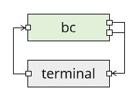

# Concurrent programming in POSIX

In the undergraduate degree at Bristol, students study concurrent programming using the go programming language, which provides an abstraction called _channels_ that different _actors_ can use to talk to each other. In the case of go, the actors are threads, but the same principle applies to a concurrent system with different processes, in which case channels are a kind of _inter-process communication (IPC)_. In POSIX, pipes are a kind of channel.

  - If one process reads from a pipe, then this blocks the process until another process writes to it.
  - If one process writes to a pipe, then this blocks the process until another process reads from it.
  - If one process reads from a pipe and another process writes to it (it does not matter who goes first) then the data is transferred from the reader to the writer, and both processes continue.

For example, when you use a command like `cat logfile | grep Error | wc -l` to count the number of lines containing the word "Error", then there are three processes (not counting the terminal) and two pipes involved:


_In this diagram, green boxes are processes with standard input on the left and standard output (top) and standard error (bottom) on the right. The little squares all represent file descriptors; a pipe has two of them, one each for reading and writing._

This is not yet a fully concurrent system though, as data is only flowing in one direction: there are no loops.

As a little example of something that does have a loop, we are going to use the `bc` calculator program, which (once installed) reads a line from standard input, evaluates it as a formula, and writes the result to standard output:

    vagrant@debian12$ bc
    (you type ) 2+3
    (bc prints) 5
    (you type ) 1+1
    (bc prints) 2

`bc` reads in a loop, so type `^D` to close its standard input, then you get back to the terminal.

As a diagram, the interaction with bc looks like this:



_Here the terminal's right file descriptor is the one that the terminal reads, and the left one is where the terminal writes your keyboard input. But there's still a human in the loop here._

We are going to write a program that can talk to `bc`. This means we have two processes, our program and `bc`, and they need to communicate with each other. We will use pipes for this, giving the following diagram where we call the pipes _up_ and _down_:


_In this diagram, data flows through pipes from left to right, but logically the "down" pipe is for data flowing from our program downwards to bc, and the "up" pipe is for data flowing back up again. Standard error is not shown (it still goes to the terminal)._

The `bc` program does not need to know about any of this: it still reads expressions from its standard input, evaluates them, and writes them to standard output.

Notice that when we used a pipe character `|` in the shell, it automatically set up the pipes for us so each pipe had one reader and one writer. When we set the pipes up ourselves, we will have to take care of this ourselves too.

## The first program

Study the following program. It tries to add the numbers from 1 to 10 by writing the sums (1+2 etc.) to standard output, and reading the result back from standard input. You can compile it with `gcc -std=c99 -Wall ipc1.c -o ipc1` and then run it yourself: it prints `1+2` and if you reply `3`, it follows up with `3+3` and so on. After ten steps, it prints the result and exits.

```c
/* ipc1.c */
#include <stdio.h>
#include <string.h>
#include <errno.h>
#include <stdlib.h>

void check(int ok, char *where) {
  if (ok < 0) {
    fprintf(stderr, "Error in %s: %s\n", where, strerror(errno));
    exit(1);
  }
}

int evaluate(char *buffer, int len) {
  fprintf(stderr, "> %s", buffer);

  int ok = printf("%s", buffer);
  if (ok < 0) {
    return -1;
  }
  char* p = fgets(buffer, len, stdin);
  if (p == NULL) {
    return -1;
  }
  fprintf(stderr, "< %s", buffer);
  return 0;
}

int main() {
  char buffer[100];
  int ok;

  setbuf(stdout, NULL);
  setbuf(stdin, NULL);

  strcpy(buffer, "1+2\n");

  ok = evaluate(buffer, sizeof(buffer));
  check(ok, "I/O");
  
  for (int i = 3; i <= 10; i++) {
    sprintf(buffer + strlen(buffer) - 1, "+%u\n", i);
    ok = evaluate(buffer, sizeof(buffer));
    check(ok, "I/O");
  }
  fprintf(stderr, "The result is %s", buffer);
  return 0;
}
```

The program also prints a copy of all its input and output to standard error so you can see what data is being transferred. The transfer happens in `evaluate`:

  1. First, it prints the buffer to standard error.
  2. Then, it prints the buffer to standard output with printf. Checking the return value of printf is extremely paranoid, but we're about to use the program in a situation where standard output is not the terminal, so it could potentially fail.
  3. Next, it reads a line from standard input with fgets. Checking the return value here is good practice even if you're not paranoid.
  4. Finally, it prints the received value to standard error - note that if `fgets` had returned NULL, then it would not be safe to access the buffer.

Once you are familiar with how the program works, you can comment out the lines that print to standard error if you like and run it again to see exactly what happens on standard input/output and nothing else. Then, uncomment the lines again.

|||advanced
You could also use another trick to disambiguate standard output/error (for programs that don't, like this one, indicate which is which: the lines starting `>` or `<` are standard error).

```sh
escape=$(printf '\033')
./ipc 2> >(sed -e "s/\(.*\)/${escape}[32m\1${escape}[0m/")
```

This might mess up the last line on your terminal a bit, but you can reset it with Control+L.
The first command sets a shell variable to the ANSI escape character. The second line redirects standard error (`2>`) to a subprocess (`>(...)`) which calls the stream editor `sed` to replace each line with the line surrounded by `\e[32m` (set colour to green) and `\e[0m` (reset colour). This will make the standard error lines appear in green. 

Incidentally, some versions of sed support the `\e` escape sequence directly, or at least the version `\x1b` that creates a character from its ASCII code in hexadecimal, but some versions do not, so you need the shell variable trick with a fall back to octal (033) notation!
|||

And now for the interesting part:

  - Make two named pipes (FIFOs) with `mkfifo up` and `mkfifo down`.
  - You will need two terminals open for the following. Either ssh into your Debian box a second time or, better still, use tmux (`Control+B, %` opens a second terminal beside the first one; you can use `Control+B, Left` and `Control+B, Right` to switch between them).
  - Run the program with `./ipc1 > down < up` to redirect standard input and output to the pipes. This blocks (exercise: which statement is it currently blocking on?).
  - In the second terminal, run `bc < down > up`.

Both processes should now terminate, and although you won't see the pipes directly, standard error of your program is printing a copy to the terminal, where `>` is data sent to down pipe and `<` is data received on the up pipe:

    > 1+2
    < 3
    > 3+3
    < 6
    > 6+4
    < 10
    ...
    > 45+10
    < 55
    The result is 55

Note that the program printed the "The result is ..." line to standard error too, otherwise you would not see it here.
