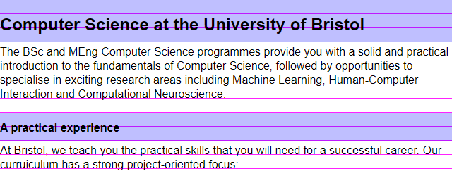

# Styling Text

Under [resources/sometext.html](../resources/sometext.html) you have a basic text-based HTML document with some information about your degree. Download this file and open it in your browser, you will see it displayed with the default stylesheet (and any customisations you might have applied, such as selecting a default font and size).

## Reading Mode

Many browsers have a _reading mode_ which is meant to make text as east to read as possible. Let's simulate this - create a new link to a stylesheet in the header (call it something like `sometext.css`) and insert the following:

```css
body {
    margin: 0 auto;
    max-width: 40em;
    line-height: 125%;
}
```

This already looks much better, but you can play with the parameters to get something that's perfect for you.

  - The `max-width` is doing most of the work here, following the design principle (that's fairly well replicated with studies) that most people find text easier to read if lines are not much longer than some limit, quoted variously as [around 60 characters](https://baymard.com/blog/line-length-readability). Since an 'm' is wider than the average character and `em` rather than e.g. `px` is the correct thing to use here (as it's relative to the font being used), I went for 40em.
  - The `margin: 0 auto` centers content horizontally if it has a fixed width. The space around the text both gets the left margin away from the edge of the window, and gives the eye an area around the text free of distractions.
  - Increasing the line height follows the same principle, sometimes known as giving the text _room to breathe_. Experiment with differnt line heights if you like to see which one suits you best. Note: it's possible to overdo this. Double-spacing (`line-height: 200%`) was common for dissertations in the typewriter era, mainly to give proofreaders and markers space to write comments between the lines. This is considered bad design nowadays, and you should not do it.

If you want, you can try a few other things:
  
  - Change the `font-size`. The default is `16px` but depending on your screen size, resolution and distance from your eyes you might want a larger one.
  - Set a different `font-family`. The values `serif` and `sans-serif` give default choices across all operating systems, you could set this to a more specific font on yours such as `Calibri` (if on Windows) but bear in mind this will not work for Mac users.
  - Set a `background-color` on the body, either a light but not quite white one (pale yellow/brown is often used), or go dark mode with a dark backround and a light `color` for the font itself.

|||advanced
Tricks like this - which you can code as a browser extension if you want to - might be particularly helpful for visually impaired or dyslexic students so you can force any website to use fonts and styles that work for you.

If you are designing for dyslexic people other than yourself, the best you can do is give them a way to configure the fonts and colours themselves (for example with a menu that lets you change them via JavaScript) - different dyslexic people might have different preferences that work for them, for example one person may prefer serif fonts to sans-serif or the other way round, there is no one best design for everyone.

There are statistical trends which mean that "use sans serif fonts" is good advice if you have to pick one font (for example for printed material) but one of the advantages of the web is that you do not have to choose one font in advance, you can let different users select different preferences.
|||

## Starting from Scratch

Uncomment the line that includes `reset.css` in the HTML file (comments go from `<!--` to `-->`, a relic of when HTML was connected with XML). The file is at [resources/reset.css](../resources/reset.css) so download it to the same folder as your HTML file.

You now have almost no styling at all: headings, lists, paragraphs all just look like text.

In your own stylesheet, which you should include _after_ `reset.css`, either try and recreate the default settings or try out ones that look good to you.

Headings are meant to stand out among the paragraphs, and the extra white space around them (padding or margin) is as important as the larger font size and bold font. You could try leaving headings the same size as the body font but still `font-weight: bold` and use just padding to make them stand out. (Since a heading relates to the text after it not the text before it, it is good design to have a greater margin/padding above the heading than below it.)

The default body font size is `font-size: 16px`. If you want to make the headings larger, you should not set an absolute value (such as 24px) but one relative to the default size. Since the default size comes from the `<html>` and `<body>` elements, you have two ways to do this: either with a percentage e.g. `h1 { font-size: 150%; }` which makes headings 1.5 times as big as the paragraph font, or using the `em/rem` units (setting a font size in ems refers to the em size of the parent unit).

In the browser, open the developer tools and type the following in the console and press ENTER:

```js
document.body.style.fontSize="24px";
```

(Since this is JavaScript, the property is called `fontSize` not `font-size` as dashes are not allowed in identifiers.)

This increases the body text size from 16px to 24px (if you have manually set a different size in your stylesheet, you might need to set it to `"24px !important"` to override this). If you had set your headings to fixed sizes like 18px, then headings would now be smaller than the body text - if you have correctly used relative sizing, then headings will now still be 1.5 times as big as the body fonts or whichever multiple you set them to be. That is the right way to do it.

## Vertical Rhythm

Here is another design principle worth knowing about. Look at this image, part of a screenshot of one way to style the text on the page:


The principle here is that we imagine a grid with 20px high lines, and lay out everything according to that. Under [resources/baseline.png](../resources/baseline.png) there is an image 1px wide and 20px high with the last pixel coloured pink. Download that image to the folder with the HTML file and set

```css
body {
    background-image: url("baseline.png");
}
```

This will make the image repeat horizontally and vertically, and you can now see the design behind this approach:



The baselines of the paragraph text all sit on the grid lines. The important thing here is that when a heading interrupts the flow of text, the total height of the heading is an exact multiple of the grid height, even if the font size is different.

Try and recreate this layout or a similar one using vertical rhythm, starting from the reset stylesheet so you have to do everything yourself from scratch. Notes:

  - The aim is that all paragraphs have their baselines on the grid, even if there are other elements (headlings, lists) earlier in the document.
  - This means that the total height of headings must be an exact multiple of the grid size; you can assume that the text in a heading does not require more than one line.
  - You should set all sizes, including margins and padding, in terms of relative units (either ems/rems or percentages).
  - The base font size here is the default 16px. Start with the max-width and line-height from the first example, and modify the line height if necessary for your font to get the lines of paragraph text the right distance apart. 
  - The paragraphs themselves have a margin at the bottom (the empty line after the first paragraph) that also appears between paragraphs of text (not shown in the image) when one `<p>` tag follows another. You might also need to give them a small top padding to get the text on the lines, not between them.
  - The shading around the headings is `background-color: rgba(0, 0, 255, 0.25);` to be semitransparent and let the lines show through, to see that while the heading text itself doesn't have to sit on a grid line, the total height of a heading including padding does respect the grid. However this shading is just to motivate the layout: if you want an actual coloured background, then you should set a `padding-left: 0.5em;` or something on the headings to make the text not start just on the edge of a coloured box. This improves readability.
  - You will also need to style the `<ul>` list to have some spacing before and after, and to keep everything on the grid lines. You get the bullets back with the following code - or one of many other options [listed on MDN](https://developer.mozilla.org/en-US/docs/Web/CSS/list-style):

```css
ul {
    padding-left: 2em; /* the bullets appear in the padding */
    list-style-type: disc;
    list-style-position: outside;
}
```

  - Don't forget to style the link. `text-decoration: underline` is one option; or you can read more on MDN about [styling links](https://developer.mozilla.org/en-US/docs/Learn/CSS/Styling_text/Styling_links) including how to make a link someone has visited before look different to a new one.

