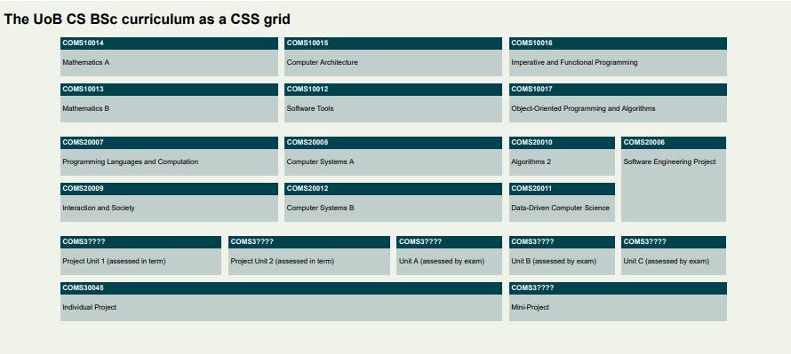

# Exercise: Curriculum

Download the file [curriculum.html](../resources/curriculum.html) and open it in an editor.


You can see that it references a stylesheet file `curriculum.css` in the same folder, so create that file.

Your task is to write a stylesheet to make the curriculum look like this (for this exercise, we do not care about responsive layout):



_(If you are a MEng student, mentally replace "individual project" with "group project" in 3rd year and then 4th year should follow the same layout as 3rd year, but you don't have to edit this in the file for this exercise.)_

The units are coded like this in the file:

    <main>
        <div class="unit y1-tb1 cp20">
            <b>COMS10014</b>
            <p>Mathematics A</p>
        </div>

Each unit is a `<div>` with class `unit` and further classes declaring its teaching block and weight in credit points. SPE in year 2 is special and is the only unit declared as `y2-tb4` with no CP class. By the way, why did we choose `cp20` and not `20cp` as the class name?

We are being pedantic here about separating content/structure (in the HTML file) and styling/layout (which you will write in a CSS file). There is no hint in the HTML file that the aim of the exercise is to lay the units out on a grid!

|||advanced
Our class names are purely semantic - they describe attributes of the units (academic year, teaching block, credit points), not how they should be displayed. There is some debate among web developers and designers just how far you should take this separation; we are being absolutely purist for this exercise, but even bootstrap, one of the most widely used web libraries, has classes like `.col-4` to make something four columns wide. In practice the answer to how you separate concerns between HTML and CSS is really a case of "it depends".
|||

Some general styles that you can apply in your `curriculum.css`:

```css
body {
    font-family: sans-serif;
    background-color: rgba(112, 145, 53, 0.1);
}

.unit {
    background-color: rgba(0, 67, 79, 0.2);
}

.unit b {
    display: block;
    background-color: rgb(0, 67, 79);
    color: white;
    padding: 5px;
}

.unit p {
    padding: 5px;
}
```

This sets the colour scheme (derived from the official University of Bristol one), and some sensible padding/margins. The `<p>` elements already come with a default margin that we don't want to change here, but note that we applied the background colour for the text boxes to the `<div class="unit">` element itself, not the `<p>` elements otherwise the margin of the `<p>` elements would not be coloured in. The 5px paddinjg that we declared everywhere creates some space between the text and the edge of the boxes, which makes the text easier to read. 

We used `<b>` tags for the title bars that are normally inline elements, but we redefined them to be block elements here (this is allowed) so they span the whole width of their grid cell.

## Exercise

  - The grid should be applied to the `<main>` element, with 12 equally wide columns and a maximum width of 1500px overall; you can center the grid for even wider screens with `margin: 0 auto;` on the main element.
  - The gap between grid cells is `15px`.
  - 10CP units should take up 2 of the 12 columns in width, 15CP units 3 columns, and 20CP units 4 columns. The 40CP project is 8 columns wide.
  - All units are one row high except SPE which is 2 rows high.
  - The aim of the exercise is not to write an individual rule for each unit! Try and use as few rules as necessary, you can do it with one rule per individual class that appears in the source file (you can even do it with a couple of rules less if you really understand grid layout).
  - The main challenge will be getting the SPE unit placed correctly, and since this disrupts the normal flow of the layout, writing the necessary rules to get everything else after that to go in its correct place again.

Extra challenge:

  - Notice that the gap between the academic years is twice as large as that within years (e.g. the vertical space between COMS10013 and COMS20007 is twice that between COMS10014 and COMS10013). 
  - This can be achieved by leaving an empty grid row between the years, thus doubling the grid gap. That is, Year 1 lives in rows 1 and 2; row 3 is empty; Year 2 lives in rows 4 and 5 and so on - the empty row 3 has a height of 0 and no elements, but there are two gaps between rows 2 and 3, and 3 and 4, that separate the Year 1 from Year 2 units.
  - Alternatively, you could add extra margin (why not padding?) to the bottom of all TB2/TB4 units to achieve the same effect.
