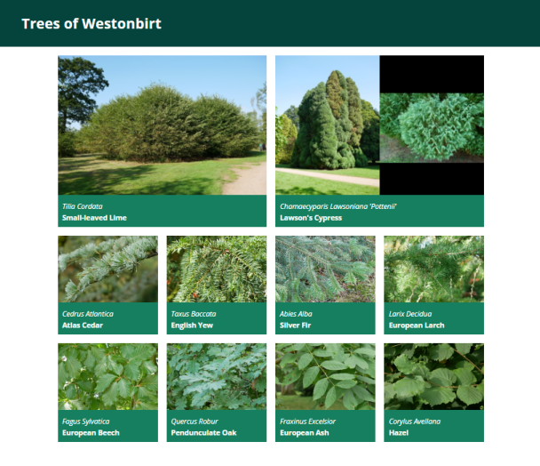
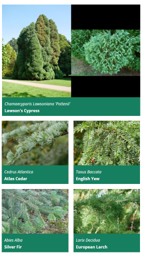

# Responsive layout: trees exercise

Download the [trees.tar.gz](../resources/trees.tar.gz) file for this exercise and extract it (`tar zxvf FILENAME`) to a folder, then open `trees.html` in your editor. Create an empty `trees.css` in the same folder and open that too.

The file contains images and English and Latin names of some trees at [Westonbirt, the UK national arboretum](https://www.forestryengland.uk/westonbirt-the-national-arboretum).

Your task is to write a stylesheet to create a responsive grid layout.

On media that is 600px or wider, the page should look like this:



(The image for Lawson's Cypress is one single PNG like the others, there is nothing special to do here to fit in two images side by side.)

_The small-leaved lime (Tilia Cordata) featured here is believed to be over 2000 years old, making it one of the oldest trees in Britain._

From 400px to 600px, the page should show all trees except the "featured" ones in two columns:



And below 400px width, all trees should be shown in a single column layout, whether featured or not.

Each tree is defined in the HTML file with an element like this:

```html
<div class="card">
    
    <span class="latin-name">Cedrus Atlantica</span>
    <span class="common-name">Atlas Cedar</span>
</div>
```

The two "featured" trees at the start also have class `featured` on their card element.

## Exercise

General non-grid-related CSS that you can just paste in:

```css
body {
    font-family: "Open Sans", sans-serif;
    margin: 0;
}

header {
    background-color: #04443c;
    color: white;
    margin: 0;
    padding: 10px;
    padding-left: 50px;
}

.card {
    background-color: #167f5f;
    color: white;
}

.card-image {
    max-width: 100%;
    height: auto;
}

.card span.latin-name {
    display: block;
    font-style: italic;
    padding: 10px;
    padding-bottom: 0;
}

.card span.common-name {
    display: block;
    padding: 10px;
    padding-top: 5px;
    font-weight: bold;
}
```

  - The grid should be horizontally centered if the screen is wider than the grid, by setting `margin: 0 auto` on the container.
  - The grid should be applied to the container div, with  a margin of 20px on top and bottom (this has to come after the horizontal centering), and a padding of 10px on left and right (this has to be padding, not margin, to avoid undoing the centering again).
  - Set a grid gap of 20px.
  - If the screen is at least 600px wide, then the container should have a maximum width of 960px and four equally wide columns. Featured trees should take up a 2x2 space on the grid, all other trees a 1x1 space.
  - Between 400px and 600px, the grid should only be two columns wide, trees still take up 2x2 space if featured and 1x1 otherwise.
  - Below 400px, make a grid with only one column, and all trees take up 1x1 space. Note that you do not need to do anything for this as this is the default - just make sure that your other grid rules such as making featured trees 2x2 only apply on larger screens.

Test this out by making your browser window wider and narrower. You cannot normally make a chrome/edge window narrower than 400px, but there are two workarounds. With the F12 developer tools open, you can position them to the right of the window and then drag the divider to make the actual page width as narrow as you want, or you can switch to "mobile" mode (second icon in top left of developer tools, usually) and manually set a page size or select one from a dropdown list of common phone models.

|||advanced
In practice, one would use a layout like this to make the individual grid elements clickable (such as news stories, or in this case links to a more detailed page about the tree).

One way to do this would be to use `<a class="card" href="...">` elements instead of `<div>` ones, and set them manually to `display:block`. This has the advantage that the entire card, including the image, becomes clickable. An `<a>` tag can contain arbitrary content, not just text.
|||
